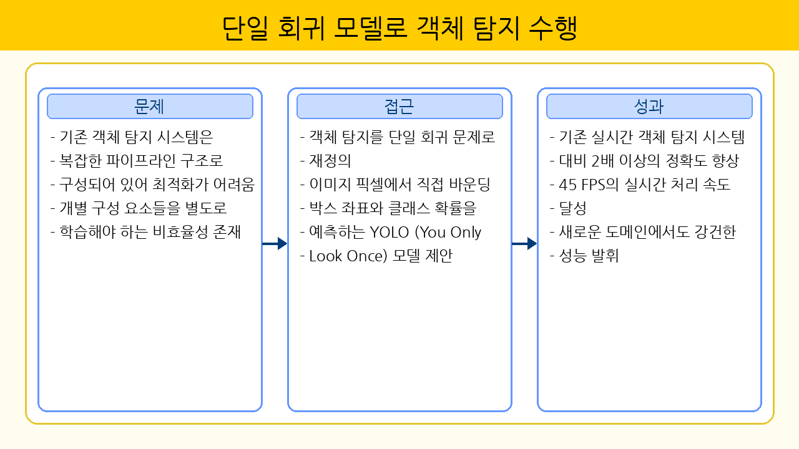
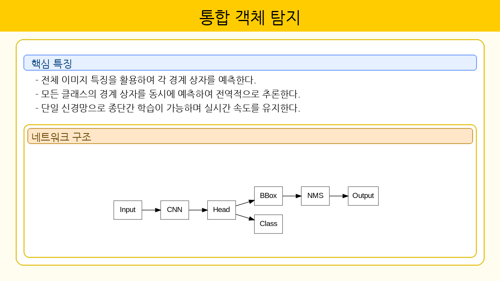
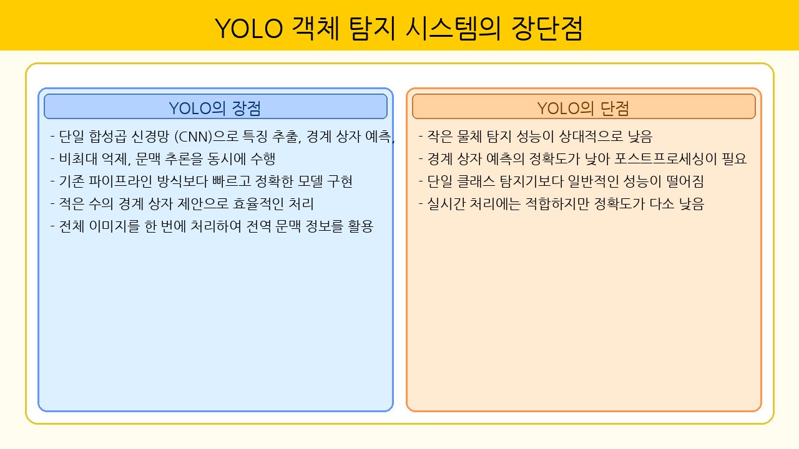
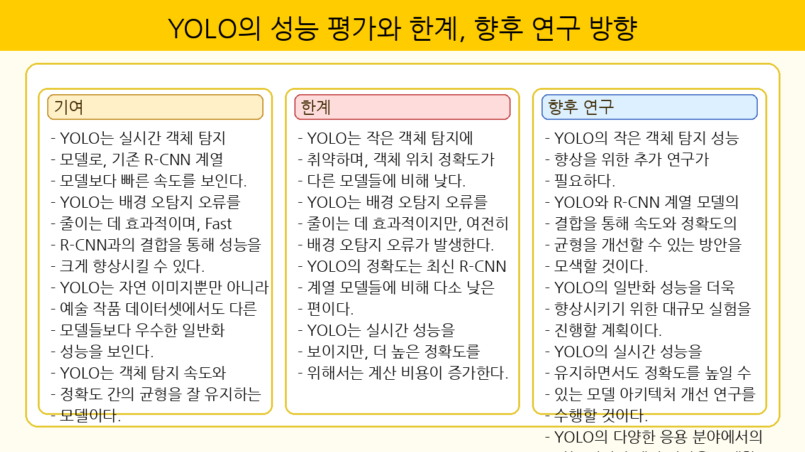
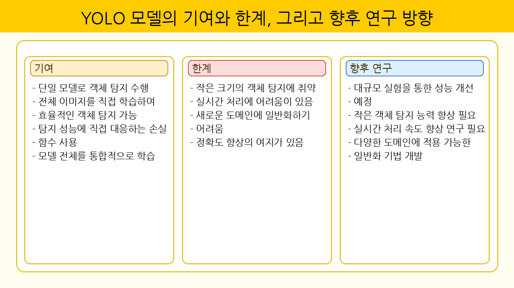
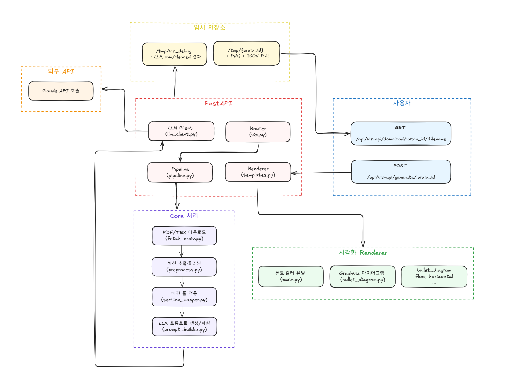

# paper-viz

논문 PDF를 입력받아 **섹션 단위 슬라이드 이미지**를 자동 생성하는 프로젝트입니다.  
LLM을 통해 슬라이드 JSON을 만들고, Renderer(Pillow/Graphviz)를 이용해 발표용 PNG로 변환합니다.  
최종 결과물은 **가로형 슬라이드 이미지 묶음**이며, 연구 발표나 논문 리뷰 자료로 활용할 수 있습니다.

<br>

## 🖼️ Demo Results

|  |                |  |
| ------------------------------------ | ------------------------------------------------------- | ------------------------------------------------------------- |
|   |  |                             |

<br><br>

## 🚀 Quick Start

### 1) Build & Run with Docker

```bash
docker build -t paper-viz .
docker run -d -p 8010:8010 --env-file .env --name paper-viz paper-viz
```

헬스체크:

```bash
curl http://localhost:8010/healthz
```

<br>

### 2) Request Slide Generation

예) YOLOv1 논문(`1506.02640`) 변환:

```bash
curl -X POST http://localhost:8010/api/viz-api/generate/1506.02640
```

응답 예시:

```json
{
  "arxiv_id": "1506.02640",
  "pdf_size": 543210,
  "sections": [
    {
      "order": 0,
      "title": "Introduction",
      "layout": "flow_horizontal",
      "slide_title": "YOLO의 핵심 개념",
      "preview": "iVBORw0KGgoAAAANSUhEUgAA...",
      "download_url": "/api/viz-api/download/1506.02640/0_Introduction.png"
    }
  ]
}
```

<br>

### 3) Download Result PNG

```bash
curl -O http://localhost:8010/api/viz-api/download/1506.02640/0_Introduction.png
```

> 다운로드 직후 서버 캐시 파일은 삭제됩니다.

<br><br>

## ✨ Features

- **전처리**: arXiv PDF/TEX → 섹션 텍스트 추출
- **매핑**: `configs/section_mapping.yaml` 기반 섹션→슬롯/레이아웃 결정
- **LLM**: `configs/layout_rules.yaml` 규칙에 맞춰 JSON 생성
- **렌더링**: Pillow/Graphviz 기반 발표용 PNG 생성
- **API**: FastAPI REST API

  - `POST /api/viz-api/generate/{arxiv_id}`
  - `GET /api/viz-api/download/{arxiv_id}/{filename}.png`
  - `GET /healthz`

<br><br>

## 🧱 System Architecture



<br><br>

## 📦 Directory Structure

```bash
src/
  core/
    pipeline.py         # 파이프라인 전체 실행
    preprocess.py       # 섹션 추출/정리
    fetch_arxiv.py      # arXiv 다운로드
    prompt_builder.py   # LLM 프롬프트/파싱
  renderer/
    base.py             # 폰트/색/공통 드로잉 유틸
    templates.py        # layout → renderer 매핑
    bullet.py           # bullet_layout
    flow_horizontal.py  # flow_horizontal
    split.py            # split_layout
    table.py            # table_layout
    composite.py        # composite_layout
    warning_bullet.py   # warning_bullet
    timeline.py         # timeline
    bullet_diagram.py   # bullet + diagram
  services/
    llm_client.py       # Anthropic(Claude) 호출
  config/
    settings.py         # .env 로딩
    section_mapper.py   # 섹션명→매핑 로직
  api/
    main.py             # FastAPI 진입점
    viz.py              # API 엔드포인트
configs/
  section_mapping.yaml
  layout_rules.yaml
tests/
  test_pipeline_run.py
```

<br><br>

## ⚙️ Installation & Local Run

```bash
python -m venv .venv
# Windows
.\.venv\Scripts\activate
# macOS/Linux
source .venv/bin/activate

pip install --upgrade pip
pip install -r requirements.txt

uvicorn src.api.main:app --reload --host 0.0.0.0 --port 8010
```

<br><br>

## 🔐 Environment Variables

```env
ANTHROPIC_API_KEY=sk-...
CLAUDE_DEFAULT_MODEL=claude-3-haiku-20240307
CLAUDE_MAX_TOKENS=4096
CLAUDE_TEMPERATURE=0.2
DEBUG_DIR=/tmp/viz_debug
```

<br><br>

## 🧪 Tests

```bash
pytest -s tests/test_pipeline_run.py
```

<br><br>

## 📑 API Summary

| Method | Path                                              | 설명                           |
| -----: | ------------------------------------------------- | ------------------------------ |
|    GET | `/healthz`                                        | 헬스체크                       |
|   POST | `/api/viz-api/generate/{arxiv_id}`                | 섹션별 PNG 생성 + URL 반환     |
|    GET | `/api/viz-api/download/{arxiv_id}/{filename}.png` | PNG 다운로드 후 서버 캐시 삭제 |

<br><br>

## 🖼️ Visualization Layout Guide

- **bullet_layout**: 세로 step
- **flow_horizontal**: 좌→우 흐름
- **split_layout**: 좌/우 비교
- **table_layout**: 성능 비교
- **composite_layout**: 3개 병렬 블록
- **warning_bullet**: 경고 테마
- **timeline**: 시간 흐름 단계
- **bullet_diagram**: 불릿 + 다이어그램

```

```
