# paper-viz

논문 PDF에서 섹션을 뽑아 **LLM으로 슬라이드 콘텐츠(JSON)** 를 생성하고,  
**Renderer(Pillow/Graphviz)** 로 발표용 PNG를 만든다.  
최종 산출물은 섹션 단위의 가로형 슬라이드 이미지 묶음.

---

## 🚀 빠른 시작 (Quick Start)

### 1. Docker 빌드 & 실행

```bash
docker build -t paper-viz .
docker run -d -p 8010:8010 --env-file .env paper-viz
````

### 2. 슬라이드 생성 요청

예: YOLOv1 논문(`1506.02640`) 변환 요청

```bash
curl -X POST http://localhost:8010/api/viz-api/generate/1506.02640
```

응답 예시:

```json
{
  "arxiv_id": "1506.02640",
  "pdf_size": 543210,
  "sections": [
    {
      "order": 0,
      "title": "Introduction",
      "layout": "flow_horizontal",
      "slide_title": "YOLO의 핵심 개념",
      "preview": "iVBORw0KGgoAAAANSUhEUgAA...",   // Base64 PNG 미리보기
      "download_url": "/api/viz-api/download/1506.02640/0_Introduction.png"
    }
  ]
}
```

### 3. 결과 PNG 다운로드

응답의 `download_url`을 호출:

```bash
curl -O http://localhost:8010/api/viz-api/download/1506.02640/0_Introduction.png
```

* 파일 저장 후, 서버에서는 해당 PNG를 즉시 삭제함
* 두 번째 요청 시 `"File not found"` 응답 확인 가능

---
## 시스템 구조

```mermaid
flowchart TD
    subgraph Client[사용자]
        C1[POST /api/viz-api/generate/:arxiv_id]
        C2[GET /api/viz-api/download/:arxiv_id/:filename]
    end

    subgraph FastAPI
        A1[viz.py Router]
        A2[pipeline.py]
        A3[renderer/templates.py]
        A4[llm_client.py]
    end

    subgraph Core
        B1[fetch_arxiv.py - PDF/TEX 다운로드]
        B2[preprocess.py - 섹션 추출/클리닝]
        B3[section_mapper.py - 매핑 룰 적용]
        B4[prompt_builder.py - LLM 프롬프트 생성/파싱]
    end

    subgraph Services
        S1[Anthropic Claude API 호출]
    end

    subgraph Renderer
        R1[bullet, flow_horizontal 등]
        R2[bullet_diagram - Graphviz]
        R3[base.py - 폰트/컬러/유틸]
    end

    subgraph Storage
        F1["/tmp/{arxiv_id} - PNG + JSON 캐시"]
        F2["/tmp/viz_debug - LLM raw/cleaned 결과"]
    end

    C1 --> A1 --> A2
    A2 --> B1 --> B2 --> B3 --> B4 --> A4 --> S1
    A2 --> A3 --> R1 & R2 & R3
    A3 --> F1
    F1 --> C2
    A4 --> F2
```




---

## 기능 개요

* **전처리**: arXiv에서 PDF/TEX 가져와 섹션 텍스트 추출
* **매핑**: `configs/section_mapping.yaml`에 따라 섹션→슬롯/레이아웃 결정
* **LLM**: `configs/layout_rules.yaml` 규칙에 맞춰 `slide_title` + `slots` JSON 생성
* **렌더링**: Pillow/Graphviz 기반 템플릿으로 발표 스타일 PNG 생성
* **API 제공**: FastAPI 기반 REST API

  * `POST /api/viz-api/generate/{arxiv_id}` → PNG 생성 & 미리보기 + 다운로드 URL 반환
  * `GET /api/viz-api/download/{arxiv_id}/{filename}.png` → PNG 다운로드 (다운로드 직후 삭제)

---

## 디렉터리 구조

```bash
src/
  core/
    pipeline.py         # 파이프라인 전체 실행
    preprocess.py       # 섹션 추출/정리
    fetch_arxiv.py      # arXiv 다운로드
    prompt_builder.py   # LLM 프롬프트/파싱
  renderer/
    base.py             # 폰트/색/공통 드로잉 유틸
    templates.py        # layout → renderer 매핑
    bullet.py           # bullet_layout (세로 step)
    flow_horizontal.py  # flow_horizontal (좌→우 흐름)
    split.py            # split_layout (좌/우 비교)
    table.py            # table_layout (비교 테이블)
    composite.py        # composite_layout (3개 병렬)
    warning_bullet.py   # warning_bullet (주의사항)
    timeline.py         # timeline (타임라인)
    bullet_diagram.py   # bullet + diagram 혼합
  services/
    llm_client.py       # Anthropic(Claude) 호출
  config/
    settings.py         # .env 로딩(Pydantic Settings)
    section_mapper.py   # 섹션명→매핑 로직
  api/
    main.py             # FastAPI 진입점
    viz.py              # API 엔드포인트
configs/
  section_mapping.yaml  # 섹션명→{slots, layout}
  layout_rules.yaml     # 레이아웃 규칙/예시
tests/
  test_pipeline_run.py  # 통합 실행 테스트
```

---

## 설치 (개발 환경)

```bash
python -m venv .venv
# Windows
.\.venv\Scripts\activate
# macOS/Linux
source .venv/bin/activate

pip install --upgrade pip
pip install -r requirements.txt
```

---

## 환경 변수(.env)

```env
ANTHROPIC_API_KEY=sk-...
CLAUDE_DEFAULT_MODEL=claude-3-haiku-20240307
CLAUDE_MAX_TOKENS=4096
CLAUDE_TEMPERATURE=0.2

# 디버깅용 JSON 저장 위치
DEBUG_DIR=/tmp/viz_debug
```

---

## 실행 (로컬 개발)

```bash
uvicorn src.api.main:app --reload --host 0.0.0.0 --port 8010
```

엔드포인트:

* `GET /healthz` → 헬스체크
* `POST /api/viz-api/generate/{arxiv_id}` → 슬라이드 생성
* `GET /api/viz-api/download/{arxiv_id}/{filename}.png` → PNG 다운로드

---

## 테스트

```bash
pytest -s tests/test_pipeline_run.py
```

---

## Docker 배포

### .dockerignore 예시

```dockerignore
.git
__pycache__/
*.pyc
*.pyo
*.pyd
*.db
*.sqlite3
.venv
tests/output/*
tests/_debug/*
```

---

## LLM 출력 스키마 (예)

```json
{
  "layout": "flow_horizontal",
  "slide_title": "데이터 부족 문제 해결",
  "slots": {
    "Problem": { "subtitle": "문제", "content": ["데이터 부족"] },
    "Approach": { "subtitle": "접근", "content": ["사전학습 활용"] },
    "Result": { "subtitle": "성과", "content": ["성능 20% 향상"] }
  }
}
```

---

## 시각화 가이드

* **bullet\_layout**: 세로 step
* **flow\_horizontal**: 좌→우 흐름
* **split\_layout**: 좌/우 비교
* **table\_layout**: 성능 비교
* **composite\_layout**: 3개 병렬 블록
* **warning\_bullet**: 경고 테마
* **timeline**: 시간 흐름 단계
* **bullet\_diagram**: 불릿 + Graphviz 다이어그램


